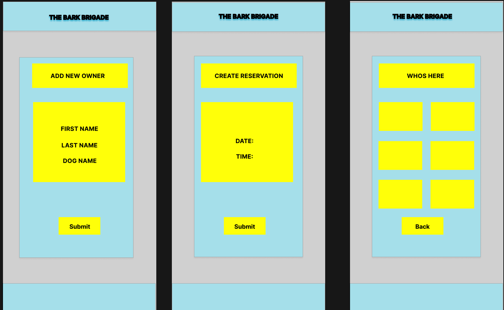

# TheBarkBrigade
Sales and Data tracking for a dog park

**Technologies Used**
HTML
CSS
JavaScript
Node.js
Express
Mongoose
Axios

***Function***

This app will have a simple log in user interface screen. 

The main screen will display a few options such as a button to add a new dog, a button to add a new owner, a button to add a new visit, and a button to view the current dogs in the park.

The add a new dog button will take the user to a screen where they can enter the dogs name, breed, and age. Once the user has entered the information they will be able to save the dog to the database.

The add a new owner button will take the user to a screen where they can enter the owners name, phone number, and email. Once the user has entered the information they will be able to save the owner to the database.

The add a new visit button will take the user to a screen where they can select a dog from a drop down menu, select an owner from a drop down menu, and enter the date of the visit. Once the user has entered the information they will be able to save the visit to the database.

The view current dogs button will take the user to a screen where they can see all the dogs currently in the park. The user will be able to select a dog and see all the visits that dog has had. The user will also be able to select a visit and see the owner of the dog that visited the park on that date.

***Wire Frame***

